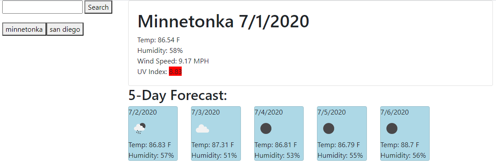

# Weather Dashboard

## Description 
A weather dashboard that will give a current day forecast and a five-day forecast for a searched for city.

## Table of Contents 
[Installation](#installation)

[Usage](#usage)

[License](#license)

[Contributing](#contributing)

[Tests](#tests)

[Questions](#questions)
## Installation
Download the source code, then in the folder with script.js run "npm install". 

## Usage
In the folder with script.js run "node script.js". Seach for a city using the box in the top left of the screen.

## License
This is licensed under the [MIT license](https://choosealicense.com/licenses/mit/).

## Contributing
Feel free to contribute

## Tests
No tests at the moment

## Questions
GitHub: https://github.com/tober65
Email: timothy.ober@gmail.com